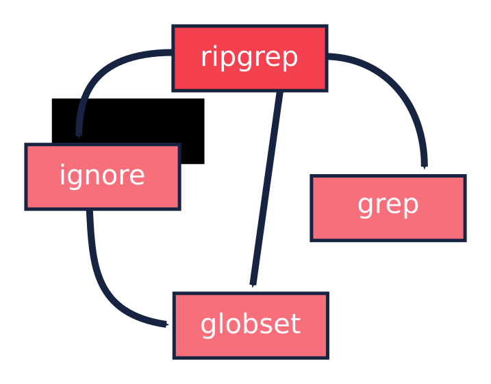

Ripgrep code review
===================

TOC
---

1. Introduction
2. Big picture
3. The file listing
    1. Ignore patterns
4. The search process
5. Multi-threading
6. Output handling


Introduction
------------

I've been playing around with [Rust](https://www.rust-lang.org) for a year and a
half, and as many other people already said, the best of it is the very
welcoming and helpful community. There are a lot of online resources that help
you to get started: the [Rust book](https://doc.rust-lang.org/book/), the
[Rustonomicon](https://doc.rust-lang.org/nomicon/) and many blog posts and stack
overflow questions. After I learned the basics I felt a bit lost though, since
not many advanced topics are available. As a C++ developer I miss indeed books
like [Effective C++](http://www.aristeia.com/books.html) from Scott Meyers, and
people like [Herb Sutter](https://herbsutter.com/). They provide a lot of
insights besides the basics. They teach you how to get the best from the
language, how to use it properly, and how to structure your code to be more
clear and effective.

How do you learn those things then? You look at how the best developers work.
I think code reviews are incredibly useful; you can see how other people reason
about problems you also struggled with, and how they have solved them. This post
is an attempt to do so, by looking at the
[ripgrep](https://github.com/BurntSushi/ripgrep) crate by Andrew Gallant, which
is a great example of good Rust, in my opinion.

I'm not going to explain everything about the crate, since there is already a
very good [blog post](http://blog.burntsushi.net/ripgrep/) by Andrew himself,
explaining how the application works from a functional perspective, compared to
GNU grep, the Silver Searcher (`ag`), and other similar tools. Our perspective
is instead more implementation driven. We are going to walk through the crate
architecture. As a side note, this post is not intended for complete beginners
since I'm going to take for granted the basics. If you need some of them, just
take a look at the resources I mentioned before.

So, without further ado, let's get started.

The big picture
---------------

We are going to look at this specific version of the crate:

```
$ git describe
0.2.5-4-gf728708
```

which is the last one at the time of writing. As you read, the code might have
evolved. So if you want to follow the code live, it's better to checkout this
specific version:

```
$ git clone https://github.com/BurntSushi/ripgrep.git
$ cd ripgrep
$ git checkout f728708
```

Ripgrep is a command line tool for searching file contents using regular
expressions, similar to GNU grep. The tool is not a single crate, but split
across four: the main one, `ignore`, `grep` and `globset`.


